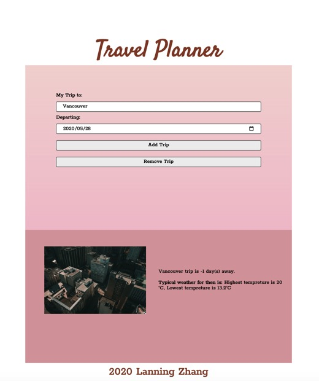

# Travel Planner App

## Connect to 3 APIs:

- Geonames API;
- Weatherbit API;
- Pixabay API

## What is covered:

- Webpack entry point
- Webpack output and dist folder
- Webpack Loaders
- Webpack Plugins
- Webpack Mode
- Tools for convenient Webpack development
- Service Workers
- Set up styles

## Extend your Project/Ways to Stand Out 

- Allow the user to remove the trip

## How to start the app

- Run with `npm run build-dev`in Terminal
- localhost:8081

